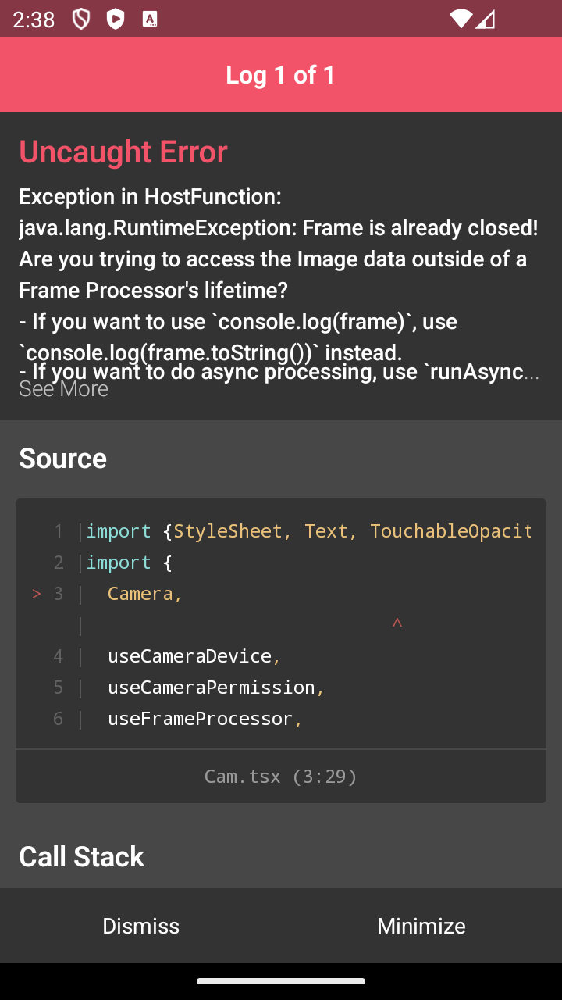

# CameraTester

npx expo prebuild --platform android

## Issues
This repo demonstrates two issues on Android.

1. Opening the camera via state and then closing it leaves a black rectangle behind

2. Rapidly opening and closing the camera with a frame processor crashes with one of those two errors.
Actually not fully sure about the rapidly part. But opening and closing multiple times leads to a crash. In my testing anything between 1 and 20 times opening/closing the camera via a state change.

